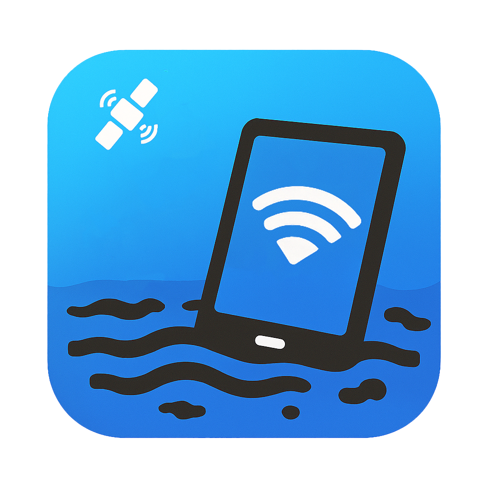

# RiverSense Code

  

This directory contains the source code for the RiverSense project, which is divided into two main components:

- **[RiverSense-App](./RiverSense-App/README.md):** The Android application that collects GNSS data from the user's device.
- **[RiverSense-Server](./RiverSense-Server/README.md):** The server-side application that processes the collected data and provides the final analysis.

For more detailed information, please refer to the README file within each respective directory.
